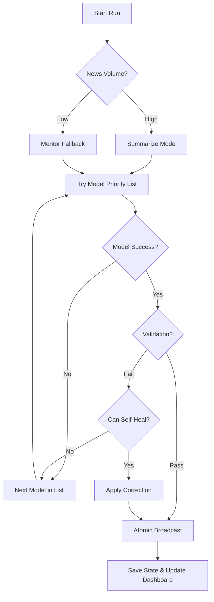

# 👨‍🔧 BluBot: Elite AI News Curator

Automated AI news curator that fetches updates twice daily, synthesizes them using **Sage Intelligence (Multi-Model Failover)**, and broadcasts insightfully to **Bluesky**, **Mastodon**, and **Threads**—all running entirely for free on **GitHub Actions**.

## 📊 System Status
| Component | Status | Last Run | Mode |
|:---|:---|:---|:---|
| **Broadcaster** | Operational | 2026-04-16 | 🚀 Sage Designer Engine |
| **Signal Strength** | Elite (Imagen 4) | -- | -- |

## 🚀 Key Features

- **Sage Intelligence v3 (Self-Healing AI)**: 
    - **Multi-Model Failover**: Automatically rotates through prioritized models (**`Gemini 3.1 Flash Lite`**, **`Gemma 4 31B/26B`**, **`Gemma 3 27B-IT`**) if the primary provider is saturated or fails validation.
    - **Self-Healing Loop**: Automatically corrects common AI output issues (e.g., missing hashtags) and **strips accidental markdown formatting** (bolding/italics) to ensure 100% clean posts.
    - **Self-Discovery Diagnostics**: If a model fails to validate, the bot automatically **logs every available model ID** for your key, making it effortless to identify the correct identifiers for new releases (like Gemma 3).
    - **Graceful Degradation**: If news volume is low or summarization fails, the bot intelligently degrades to "Mentor Fallback" mode.
- **Fast Async Parallel Engine**: Re-engineered with `asyncio` and a shared `httpx.AsyncClient` context to fetch 25+ RSS feeds concurrently. Processing time reduced by **90%**.
- **Fortress Hardening (v3.5.2)**: Active redaction of session strings and sanitized error logging.
- **Cross-Platform Visuals**: Enhanced media support for **Bluesky** and **Mastodon** (binary) and **Threads** (fallback logic).
- **Smart Image Compression**: Built-in **Pillow-powered optimizer** that automatically resizes thumbnails to platform-specific limits (fixing "blob too big" errors).
- **Breakthrough Scoring Engine v3 (Elite Signal Processing)**: 
    - **Impact-Aware Intelligence**: Uses a sophisticated weighted matrix to prioritize high-signal news (Agents, SOTA, Breakthroughs) and boosts articles mentioning flagship 2026 models (GPT-5, Llama-4, Claude-4).
    - **Academic Gem Expansion**: Direct integration of elite research labs (BAIR, SAIL, NVIDIA Research) with a dedicated "Hidden Gem" bonus.
    - **Consensus Synergy Pass**: Automatically identifies "Consensus Events" reported by multiple independent feeds and boosts them to the top of the queue.
    - **Semantic Diversity Engine**: Implements greedy entity-overlap deduplication to ensure the final selection (Top 8) covers a broad industry spectrum rather than a single-topic echo chamber.
- **4-State Intelligence Matrix**: Dynamically adjusts strategy based on the time of day and news volume. Switches between **The Curator** (Morning), **The Senior Analyst** (Afternoon), and **The Strategist** (Low-volume fallback).
- **The Fortress: Advanced Security**:
    - **Dynamic Log Masking**: `SafeLogger` automatically redacts sensitive tokens, keys, and passwords using dynamic environment scanning.
    - **Secure Logging Engine**: All system layers (including configuration and startup) are routed through the `SafeLogger` engine to ensure the "Fortress" protection is active from the very first line of output.
    - **Byte-Safe Truncation & Facet Sync**: Specialized logic to truncate long summaries on byte boundaries and **re-index facets dynamically**, fixing the dreaded `Forbidden (403)` errors on BlueSky.

## 🧠 Sage Intelligence: Failover Architecture

## 🛠️ Setup Instructions

### ⚙️1. Platform Credentials

#### Bluesky
- Create an **App Password** named `BluBot` in `Settings > Advanced > App Passwords`.

#### Mastodon (Optional)
- Get an **Access Token** from `Preferences > Development > New Application` with `write:statuses` scope.

#### Threads (Optional)
1.  Create a Meta App with the **Threads** use case.
2.  Enable `threads_basic` and `threads_content_publish` scopes.
3.  Add `https://localhost/` to redirect URIs.
4.  Use `setup_threads.py` to generate your **Long-Lived Access Token**.

#### Google Gemini
- Get a free API key from [Google AI Studio](https://aistudio.google.com/).

### 🤫2. Configure GitHub Secrets

| Secret Name | Required | Description |
|-------------|----------|-------------|
| `BSKY_HANDLE` | **Yes** | Your Bluesky handle (e.g., `user.bsky.social`) |
| `BSKY_APP_PASSWORD` | **Yes** | Your Bluesky App Password |
| `GEMINI_KEY` | **Yes** | Your Google Gemini API Key |
| `MASTODON_ACCESS_TOKEN` | No | Your Mastodon Access Token |
| `MASTODON_BASE_URL` | No | Your Mastodon Instance URL |
| `THREADS_ACCESS_TOKEN` | No | Your Threads Long-Lived Access Token |
| `THREADS_USER_ID` | No | Your Threads User ID |

### 🪄3. Enable Workflow Permissions
Go to `Settings > Actions > General` and ensure **"Read and write permissions"** is enabled.

## 📂 Project Structure

- `bot.py`: Main Orchestrator.
- **`src/`**: Modular logic layers:
  - `config.py`: RSS feeds, source tiers, and Sage Failover logic.
  - `logger.py`: Centralized **Secure Logging Engine** with dynamic secret masking.
  - `curator.py`: News discovery, relevance scoring, and AI synthesis.
  - `utils.py`: Resilience (@retry_with_backoff), Metadata scraping, and Image optimization.
  - `broadcaster.py`: Async platform-specific posting logic.
- `seen_articles.json`: Persistent memory of posted content.
- `test_models.py`: Unified diagnostic suite for RSS feeds & AI model validation.
- `setup_threads.py`: Interactive setup script for Threads API access.

## 🗒️ Updates & History

- **v3.5.3 (Current)**: **Threads Resilience Patch**.
    - **Stability**: Fixed `NameError` for `base_url` in the Threads broadcasting logic.
- **v3.5.2 (2026-04-16)**: **Security & Resilience Suite**.
    - **Active Redaction**: Implemented dynamic masking for `bluesky_session.txt` and JWT tokens in `SafeLogger`.
    - **Threads Resilience**: Added automatic fallback to plain TEXT if IMAGE container creation fails.
    - **MIME Fidelity**: Integrated dynamic image format detection for Mastodon binary uploads.
    - **Sanitized Logging**: Hardened exception handling to prevent leaking raw response headers and bodies.
- **v3.5.1 (2026-04-16)**: **Visual Synergy & Stability Patch**.
    - **P1 Bug Fixes**: Resolved `NameError` for `genai_client` and implemented robust **Credential Fallback** for BlueSky session logins.
    - **Cross-Platform Visuals**: Integrated binary media uploads for **Mastodon** and public URL support for **Threads**.
    - **URL Integrity**: Fixed 404/Case-sensitivity bug in metadata scraper.
- **v3.5 (2026-04-16)**: **Sage Designer & Visual Discovery**.
    - **Sage Designer Pipeline**: Integrated **Imagen 4** to generate custom technical visualizations when unique thumbnails are missing.
    - **Smart Thumbnail Engine**: Implemented site-wide logo filtering (arXiv, etc.) and semantic image discovery fallbacks.
    - **Version Sync**: Full documentation update for the v3.5 stability suite.
- **v3.4 (2026-04-16)**: **Elite Stability & API Resilience**.
    - **Session Persistence**: Implemented `atproto` session export/import with **GitHub Actions Caching** to eliminate `Rate Limit Reached` errors on login.
    - **Forbidden (403) Resolved**: Re-engineered the BlueSky broadcasting pipeline to calculate facets *after* byte-safe truncation, ensuring 100% valid metadata offsets.
    - **Smarter Retry Engine**: Refined `@retry_with_backoff` to intelligently handle 429 (Rate Limit) and 403 (Forbidden) statuses with zero-hammering logic.
    - **Network Resilience**: Increased BlueSky client timeout to **30.0s** to resolve `InvokeTimeoutError` in high-latency GitHub Action environments.
    - **Security-First Persistence**: Added `bluesky_session.txt` to `.gitignore` to prevent secret leakage in public repositories.
- **v3.3 (2026-04-15)**: **Fortress Synchronization & Dependency Resolve**.
    - **Dependency Conflict Fix**: Resolved critical installation failure by bumping `anyio` to `4.13.0`, satisfying the strict constraints of `google-genai` (≥ 1.73.1).
    - **Security Parity Audit**: Aligned all core dependencies with the latest security advisories (April 2026). Bumped `requests` to `2.33.1` to eliminate high-severity vulnerabilities.
    - **Baseline Hardening**: Verified `urllib3==2.6.3` against the latest CVE-409/CWE-770 patches.
- **v3.2.5 (2026-04-14)**: **Sage Intelligence v3** rollout. 
    - Introduced multi-model failover and self-discovery diagnostics.
    - Implemented self-healing post-formatting (markdown stripping).
    - Fixed relative URL resolution for metadata scraping (academic/arXiv fix).
    - **Breakthrough Scoring Engine v3**: Rolled out the Elite Signal Processing pipeline.
    - Added semantic deduplication (diversity engine) and consensus synergy bonuses.
    - Expanded academic research footprint (BAIR, SAIL, NVIDIA, Meta AI).
    - Hardened the "Fortress" by migrating all system layers to `SafeLogger`.
- **v3.2 (2026-04-14)**: **DeepCode AI Security Hardening**.
    - **Critical Dependency Lockdown**: Pinned all core and transitive dependencies (`Pillow`, `urllib3`, `cryptography`, `h11`) to safe versions to resolve 22+ security vulnerabilities.
    - **Advanced HTML Sanitization**: Refactored logic to use `BeautifulSoup` for high-fidelity, secure HTML stripping across 30+ feeds.
    - **Observability Overhaul**: Implemented granular exception handling to differentiate between network saturation, auth failures, and filesystem IO errors.
    - **Community Hardening**: Established [SECURITY.md](SECURITY.md) and [CONTRIBUTING.md](CONTRIBUTING.md) with "Signal Verification" guidelines.
- **v3.1 (2026-04-13)**: **Parallel Async & Security Overhaul**.
    - Re-engineered core as a high-performance `asyncio` engine with `httpx`.
    - Implemented **Atomic Broadcasting** to ensure platform-independent persistence.
    - Introduced `SafeLogger` for dynamic, environment-aware secret masking.
    - Added Pillow-powered image compression and byte-safe truncation.
    - Optimized memory with O(1) deduplication lookups.
- **v3.0 (2026-04-12)**: **4-State Persona Matrix**.
    - Added dynamic switching between Curator, Senior Analyst, and Strategist modes.
    - Integrated multi-topic fallback pool for low-volume news days.
- **v2.9 (2026-04-11)**: **Threads Integration & High-Signal Scoring**.
    - Added Threads as the third broadcasting platform.
    - Implemented Tier-based source scoring and "Hidden Gem" injection logic.

---

## 🤝 Community & Security

- **Security**: Please read our [Security Policy](SECURITY.md) before reporting vulnerabilities.
- **Contributing**: Check our [Contribution Guidelines](CONTRIBUTING.md) to help evolve the Sage persona.
- **Releasing**: To create a new release:
  1. Update the version in `VERSION` and `README.md`.
  2. Push a tag: `git tag v<version>` and `git push origin v<version>`.
- **Wiki**: Find the full technical blueprint in the [Elite Sage Manual](docs/WIKI_MANUAL.md).

*Built with ❤️ for the AI Community*
