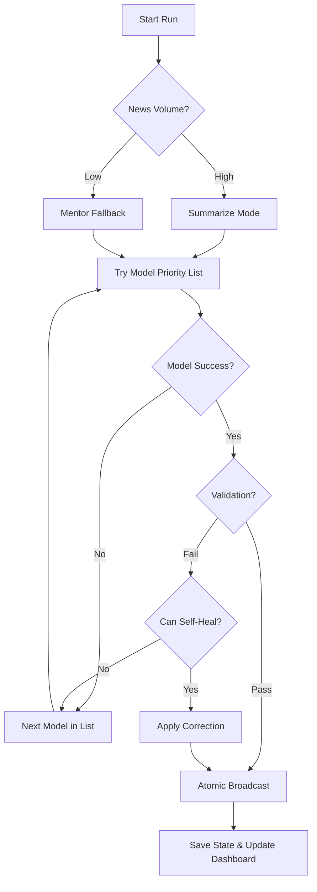

# 👨‍🔧 BluBot: Elite AI News Curator

Automated AI news curator that fetches updates twice daily, synthesizes them using **Sage Intelligence (Multi-Model Failover)**, and broadcasts insightfully to **Bluesky**, **Mastodon**, and **Threads**—all running entirely for free on **GitHub Actions**.

## 📊 System Status
| Component | Status | Last Run | Mode |
|:---|:---|:---|:---|
| **Broadcaster** | Operational | 2026-04-14 | 🚀 Async Parallel Engine |
| **Signal Strength** | Elite (Parallel) | -- | -- |

## 🚀 Key Features

- **Sage Intelligence v3 (Self-Healing AI)**: 
    - **Multi-Model Failover**: Automatically rotates through prioritized models (`Gemini 3.1 Flash Lite`, `Gemma 3 27B`, `Gemini 2.5 Flash Lite`) if the primary provider is saturated or fails validation.
    - **Self-Healing Loop**: Automatically corrects common AI output issues (e.g., missing hashtags) and **strips accidental markdown formatting** (bolding/italics) to ensure 100% clean posts.
    - **Self-Discovery Diagnostics**: If a model fails to validate, the bot automatically **logs every available model ID** for your key, making it effortless to identify the correct identifiers for new releases (like Gemma 3).
    - **Graceful Degradation**: If news volume is low or summarization fails, the bot intelligently degrades to "Mentor Fallback" mode.
- **Fast Async Parallel Engine**: Re-engineered with `asyncio` and a shared `httpx.AsyncClient` context to fetch 25+ RSS feeds concurrently. Processing time reduced by **90%**.
- **Atomic Broadcasting Engine**: 
    - Posts to Bluesky, Mastodon, and Threads simultaneously using `asyncio.gather(return_exceptions=True)`.
    - Failure on one platform (e.g., API glitch) does NOT prevent success on others or compromise state persistence.
- **Shared Session Engine**: Reuses authenticated sessions and connections across all platform operations to minimize redundant login handshakes and latency.
- **Smart Image Compression**: Built-in **Pillow-powered optimizer** that automatically resizes thumbnails to platform-specific limits (fixing "blob too big" errors).
- **Curated Signal-to-Noise Engine**: 
    - Pulls from 25+ high-signal sources (OpenAI, DeepMind, Anthropic, Hugging Face, SemiAnalysis, arXiv, etc.).
    - Uses heuristic-based scoring (Source Tiers + Product Keywords) to prioritize groundbreaking technical shifts over generic news.
- **4-State Intelligence Matrix**: Dynamically adjusts strategy based on the time of day and news volume. Switches between **The Curator** (Morning), **The Senior Analyst** (Afternoon), and **The Strategist** (Low-volume fallback).
- **The Fortress: Advanced Security**:
    - **Dynamic Log Masking**: `SafeLogger` automatically redacts sensitive tokens, keys, and passwords using dynamic environment scanning.
    - **Secure Logging Engine**: All system layers (including configuration and startup) are routed through the `SafeLogger` engine to ensure the "Fortress" protection is active from the very first line of output.
    - **Byte-Safe Truncation**: Specialized logic to truncate long summaries on byte boundaries, preventing multi-byte character (emoji) corruption.

## 🧠 Sage Intelligence: Failover Architecture

## 🛠️ Setup Instructions

### ⚙️1. Platform Credentials

#### Bluesky
- Create an **App Password** named `BluBot` in `Settings > Advanced > App Passwords`.

#### Mastodon (Optional)
- Get an **Access Token** from `Preferences > Development > New Application` with `write:statuses` scope.

#### Threads (Optional)
1.  Create a Meta App with the **Threads** use case.
2.  Enable `threads_basic` and `threads_content_publish` scopes.
3.  Add `https://localhost/` to redirect URIs.
4.  Use `setup_threads.py` to generate your **Long-Lived Access Token**.

#### Google Gemini
- Get a free API key from [Google AI Studio](https://aistudio.google.com/).

### 🤫2. Configure GitHub Secrets

| Secret Name | Required | Description |
|-------------|----------|-------------|
| `BSKY_HANDLE` | **Yes** | Your Bluesky handle (e.g., `user.bsky.social`) |
| `BSKY_APP_PASSWORD` | **Yes** | Your Bluesky App Password |
| `GEMINI_KEY` | **Yes** | Your Google Gemini API Key |
| `MASTODON_ACCESS_TOKEN` | No | Your Mastodon Access Token |
| `MASTODON_BASE_URL` | No | Your Mastodon Instance URL |
| `THREADS_ACCESS_TOKEN` | No | Your Threads Long-Lived Access Token |
| `THREADS_USER_ID` | No | Your Threads User ID |

### 🪄3. Enable Workflow Permissions
Go to `Settings > Actions > General` and ensure **"Read and write permissions"** is enabled.

## 📂 Project Structure

- `bot.py`: Main Orchestrator.
- **`src/`**: Modular logic layers:
  - `config.py`: RSS feeds, source tiers, and Sage Failover logic.
  - `logger.py`: Centralized **Secure Logging Engine** with dynamic secret masking.
  - `curator.py`: News discovery, relevance scoring, and AI synthesis.
  - `utils.py`: Resilience (@retry_with_backoff), Metadata scraping, and Image optimization.
  - `broadcaster.py`: Async platform-specific posting logic.
- `seen_articles.json`: Persistent memory of posted content.
- `debug_bot.py`: Local testing entry point.

## 🗒️ Updates & History

- **2026-04-14**: **Sage Intelligence v3** rollout. 
    - Introduced multi-model failover and self-discovery diagnostics.
    - Implemented self-healing post-formatting (markdown stripping).
    - Fixed relative URL resolution for metadata scraping (academic/arXiv fix).
    - Hardened the "Fortress" by migrating all system layers to `SafeLogger`.
- **2026-04-13**: **Parallel Async & Security Overhaul**.
    - Re-engineered core as a high-performance `asyncio` engine with `httpx`.
    - Implemented **Atomic Broadcasting** to ensure platform-independent persistence.
    - Introduced `SafeLogger` for dynamic, environment-aware secret masking.
    - Added Pillow-powered image compression and byte-safe truncation.
    - Optimized memory with O(1) deduplication lookups.
- **2026-04-12**: **4-State Persona Matrix**.
    - Added dynamic switching between Curator, Senior Analyst, and Strategist modes.
    - Integrated multi-topic fallback pool for low-volume news days.
- **2026-04-11**: **Threads Integration & High-Signal Scoring**.
    - Added Threads as the third broadcasting platform.
    - Implemented Tier-based source scoring and "Hidden Gem" injection logic.

---
*Built with ❤️ for the AI Community*
