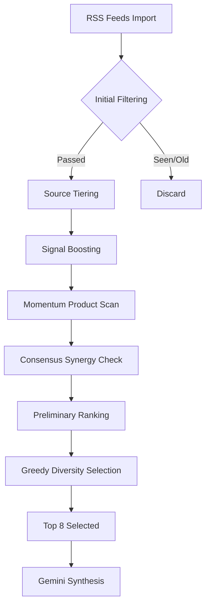
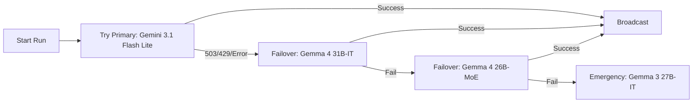
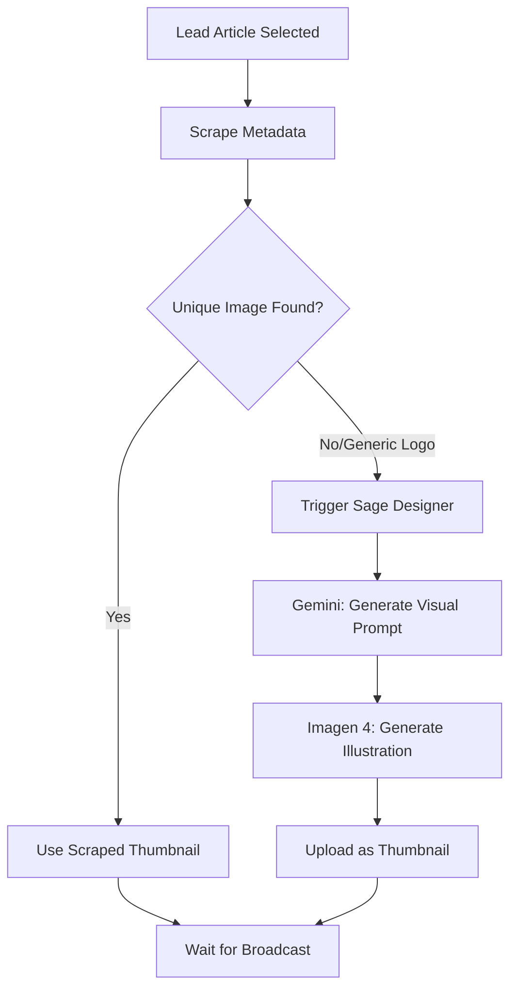

# 📖 BluBot Elite Sage: The Complete Manual

Welcome to the official Wiki for the **Elite Sage** (BluBot v3.1). This guide balances the technical inner workings with the "Sage" persona's philosophy.

---

## 🏠 Page 1: The Sage Philosophy

The BluBot is no longer a simple RSS aggregator. It is an **Impact-Aware Intelligence**. 

### The Vision
The Sage's mission is to separate the *signal* from the *noise*. In a world of hype, the Sage looks for **Product Shifts** (real code, real releases) and **Technical Gems** (research papers, deep engineering blogs).

### Platform Synergy
The Sage operates as a unified entity across three ecosystems:
- **Bluesky**: The central technical hub.
- **Mastodon**: The academic and decentralized pulse.
- **Threads**: The broad industry narrative.

---

## 🧠 Page 2: Breakthrough Scoring Engine v3

The "Brain" of the bot is the **Breakthrough Scoring Engine**. It uses a sophisticated weighted matrix to rank every article fetched from the 30+ RSS feeds.

### The Scoring Pipeline



### Impact Weighting
- **Signal Boost (+12)**: Triggered by keywords like *SOTA, Agentic, World Model, Open Weights*.
- **Momentum (+18)**: Triggered by flagship entities like *GPT-5, Llama 4, Gemini 3, Strawberry*.
- **Consensus Synergy (+15)**: Automatically applied if the same story is found in multiple independent feeds.
- **Diversity Penalty (-25)**: Applied if a topic or entity repeats too many times in the selection, forcing the Sage to broaden its perspective.

---

## 🛡️ Page 3: Reliability & The Fortress

The Sage is designed to be **unbreakable**. We have implemented "Enterprise-Hardened" reliability features to ensure the bot never misses a post.

### The Failover Loop



### v3.1 Hardening Features
- **Atomic Persistence**: The Sage uses a `.tmp` swap method to save state. It writes the "Seen Articles" to a temporary file and then performs a system-level move. This prevents data corruption even if the server crashes mid-write.
- **DeepCode Security Hardening (v3.2)**: 
    - **Dependency Fortress**: All core and transitive dependencies are pinned to safe, audited versions (`Pillow>=10.3.0`, `urllib3>=2.6.3`, `requests>=2.33.1`, `anyio>=4.13.0`, `cryptography>=46.0.6`) to eliminate vulnerabilities like Heap Overflows and Request Smuggling.
    - **Robust Sanitization**: Replaced naive regex-based HTML stripping with a robust `BeautifulSoup` text extraction engine to handle malformed feed data securely.
    - **Granular Error Handling**: Moved away from broad `except Exception` blocks to categorical catching (Networking, Auth, IO), ensuring security failures are never silenced.
- **Gemma Compatibility Layer**: A specialized logic branch that translates standard system instructions into a prompt-prepended format for Gemma models, ensuring perfect persona consistency regardless of which AI is running.
- **The Fortress**: A unified logging system that dynamically masks all environment secrets and tokens, keeping the diagnostic logs safe for public review.
- **Session Persistence & API Resilience (v3.4)**:
    - **Encrypted Session Caching**: Implemented a secure export/import layer for BlueSky sessions. By using GitHub's internal cache, the bot reuses its login state across runs, staying well below API rate limit thresholds.

---

## 🛰️ Page 4: Source Intelligence

The Sage scans over **30 premium feeds** across the industry. Here is how we prioritize them.

### Tier 1 Sources (Automatic +30 Boost)
These are primary sources where "Original Truth" is released:
- `openai.com`, `deepmind.google`, `anthropic.com`, `huggingface.co`, `mistral.ai`.

### Hidden Gem Sources (Automatic +25 Boost)
These are academic or deep-technical centers that the average news bot misses:
- `arxiv.org` (CS.AI/CS.LG), `bair.berkeley.edu`, `ai.stanford.edu`, `blogs.nvidia.com`, `thegradient.pub`.

### High-Signal Keywords
Articles containing these words trigger an immediate **+12 Signal Boost**:
> *Benchmark, Breakthrough, Agentic, Autonomous, Reasoning, Test-time compute, Scaling law.*

---

## 🛠️ Page 5: Technical Configuration

Managing the Sage requires a properly configured environment.

### Environment Secrets
| Variable | Description | Requirement |
| :--- | :--- | :--- |
| `GEMINI_KEY` | Your Google AI Studio API Key | **Critical** |
| `BSKY_HANDLE` | Your Bluesky handle (e.g., user.bsky.social) | **Critical** |
| `BSKY_APP_PASSWORD` | App-specific password from Bluesky settings | **Critical** |
| `MASTODON_TOKEN` | Access token from your Mastodon instance | Optional |
| `THREADS_TOKEN` | Long-lived Facebook Graph API token | Optional |

### Local Diagnostics
You can test the Sage locally before a production run using:
```bash
python test_models.py
```
This script will:
1. Validate your API keys and fetch available models.
2. Run a "Dry Run" of the Scraper and Scoring Engine.
3. Show you exactly how the Score was calculated for every article.

---

## 🎭 Page 6: The Persona Blueprint

The Sage isn't just a news-poster; it's a **Mentor**. Our LLM prompts are designed with specific psychological anchors:

### Core Instructions
1. **First-Person Voice**: Always uses "I" and "Me" to build a relationship with the follower.
2. **The "Mentor" Rule**: The Sage shares "findings," not "news reports." It focuses on why a change matters for engineers.
3. **The Hook**: Every post MUST end with a question that invites technical experts to share their production experiences.

### Post Constraints
- **Character Limit**: Stays under 300 bytes (for cross-platform compatibility).
- **Hashtags**: Exactly 2 relevant tags (e.g., `#AI #LLMs`).
- **Emoji Limit**: Max 1-2 subtle, conversational emojis (e.g., 🛠️, 🚀).

---

## 🎨 Page 7: Sage Designer v3.5

The Sage now possesses a **Visual Intelligence** capable of generating high-fidelity technical illustrations using **Imagen 4** (via your Google AI Studio free credits).

### The Designer Pipeline



### Key Technical Features
- **Generic Image Filtering**: The Sage automatically identifies and skips repetitive site-wide logos (like the arXiv logo) in favor of unique thumbnails. 
- **Semantic Discovery Fallsback**: If a generic logo is filtered out, the scraper attempts to find the first *real* figure or diagram within the article content.
- **Fail-Soft AI Generation**: If no unique thumbnail can be discovered, the bot calls the **Sage Designer**. Using a specialized persona, it translates the news summary into a high-fidelity, minimalist 3D isometric illustration that perfectly matches your brand's aesthetic.
