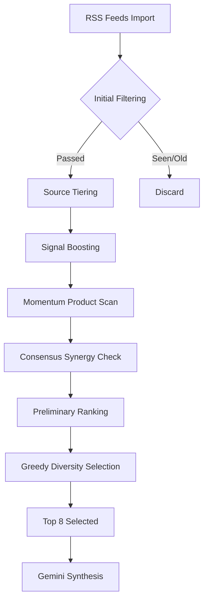
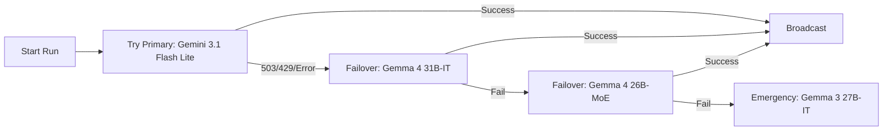

# 📖 BluBot Elite Sage: The Complete Manual

Welcome to the official Wiki for the **Elite Sage** (BluBot v3.1). This guide balances the technical inner workings with the "Sage" persona's philosophy.

---

## 🏠 Page 1: The Sage Philosophy

The BluBot is no longer a simple RSS aggregator. It is an **Impact-Aware Intelligence**. 

### The Vision
The Sage's mission is to separate the *signal* from the *noise*. In a world of hype, the Sage looks for **Product Shifts** (real code, real releases) and **Technical Gems** (research papers, deep engineering blogs).

### Platform Synergy
The Sage operates as a unified entity across three ecosystems:
- **Bluesky**: The central technical hub.
- **Mastodon**: The academic and decentralized pulse.
- **Threads**: The broad industry narrative.

---

## 🧠 Page 2: Breakthrough Scoring Engine v3

The "Brain" of the bot is the **Breakthrough Scoring Engine**. It uses a sophisticated weighted matrix to rank every article fetched from the 30+ RSS feeds.

### The Scoring Pipeline

### Impact Weighting
- **Signal Boost (+12)**: Triggered by keywords like *SOTA, Agentic, World Model*.
- **Momentum (+18)**: Triggered by flagship entities like *GPT-5, Llama 4, Claude 4*.
- **Consensus Synergy (+15)**: Automatically applied if the same story is found in multiple independent feeds.
- **Diversity Penalty (-25)**: Applied if a topic or entity repeats too many times in the selection, forcing the Sage to broaden its perspective.

---

## 🛡️ Page 3: Reliability & The Fortress

The Sage is designed to be **unbreakable**. We have implemented "Enterprise-Hardened" reliability features to ensure the bot never misses a post.

### The Failover Loop

### v3.1 Hardening Features
- **Atomic Persistence**: The Sage uses a `.tmp` swap method to save state. It writes the "Seen Articles" to a temporary file and then performs a system-level move. This prevents data corruption even if the server crashes mid-write.
- **Gemma Compatibility Layer**: A specialized logic branch that translates standard system instructions into a prompt-prepended format for Gemma models, ensuring perfect persona consistency regardless of which AI is running.
- **The Fortress**: A unified logging system that dynamically masks all environment secrets and tokens, keeping the diagnostic logs safe for public review.

---
*Built with ❤️ for the AI Community*
